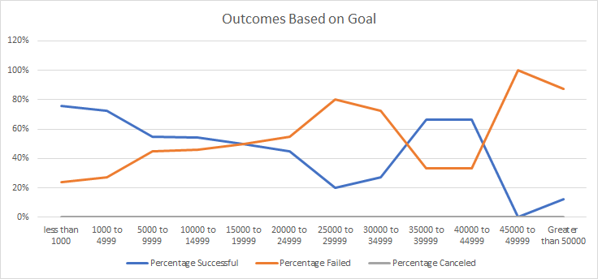

#Kickstarter-Analysis
Performing analysis on kickstarter data to uncover trends

##Overview and Purpose
The purpose of this analysis was to help Louise understand how Kickstarter campaigns have fared in relation to their launch dates and fundraising goals. To do this we started with raw data from Kickstarter that included data from a wide variety of campaigns, not just theater, going back to 2010. The data included descriptive blurbs for each campaign, campaign goals, amount pledged, number of backers, country, start and end dates, and category for each campaign. With all this data i knew it was possible to find meaningful insight, but it would take some work. 

#Challenges and Prep
One of the first challenges faced was to convert the dates into a usable format, from UNIX time to excel format. I did this using following formula in excel  =(UNIX TIME/86400)+DATE(1970,1,1). additionally, the category info was provided in a format that combined "category" and "subcategory".  to better refine our data table i converted this to two columns by identifying "/" as the delimiter. I did not encounter any major challenges or roadblocks. 

#Results 

After analyzing the data,i have drawn several conclusions. 
By looking at Theater campaign outcomes vs launch date, i have determined that Louise will have the greatest chance at a succesful campaign by launching in the month of May, or close to the month of May, if possible. The data shows a success rate of 67% for campaigns starting in the month of May. That percentage drops as you move later into the year, reaching a low of 49% in December. 

