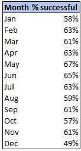

# Kickstarter-Analysis
Performing analysis on Kickstarter data to uncover trends

Analysis by Will Finnegan 

## Overview and Purpose
The purpose of this analysis was to help Louise understand how Kickstarter campaigns have fared in relation to their launch dates and fundraising goals. To do this we started with raw data from Kickstarter that included data from a wide variety of campaigns, not just theater, going back to 2010. The data included descriptive blurbs for each campaign, campaign goals, amount pledged, number of backers, country, start and end dates, and category for each campaign. By manipulating and analyzing this data we can glean insight to help Louise make informed decisions to improve the chances of successfully funding her campaign. 

## Challenges and Prep
One of the first challenges faced was to convert the dates into a usable format, from UNIX time to excel format. I did this using following formula in excel  =(UNIX TIME/86400)+DATE(1970,1,1). additionally, the category info was provided in a format that combined "category" and "subcategory". To better refine our data table i converted this to two columns by identifying "/" as the delimiter. I did not encounter any major challenges or roadblocks. 

## Results 

After analyzing the data, I have drawn several conclusions. 
By looking at Theater campaign outcomes vs launch date - see Figure 1 below - I have determined that Louise will have the greatest chance at a succesful campaign by launching in the month of May, or close to the month of May, if possible. The data shows a success rate of 67% for campaigns starting in the month of May. That percentage drops as you move later into the year, reaching a low of 49% in December, shown in Figure 2 below. 
Two conclusions can be made by looking at this data: 
1. Louise has the best chance at funding her campaign by launching in May.
2. Louise has the worst chance at funding her campaign by launching in December.

A third conclusion can be drawn by looking at outcomes vs fundraising goal, Figure 3 shows a graphic representation of this relationship. My third conclusion is this:

3. Louise has the best chance of successfully funding a campaign is by setting a low goal. 

I believe most poeple would agree with this logic, however it does not necesarily help Louise, as her costs may not be flexible. I would advise louise to carefully analyze her budget and plan a campaign with a reasonable goal that can still support her project. Additionally i would advise Louise to, no matter what, keep her goal below $45K, as projects above that goal fail in  >80% of instances. 
To Further analyze the data, one could narrow down the geography, and only look at campaigns in certain countries, or look only at more recent data. I would suggest looking at a graph or visual representation of success rates by year, to see how Kickstarter campaig success has trended year by year. 

### Figure1:

### Figure 2:

### Figure 3:

